# Node 旧后端 vs Go 新后端 · 深度对比

> 调查基于一手代码阅读，关键结论标注 `文件:行号`。
> Node 旧后端：`archive/legacy-node-backend/server/`（已归档，不再使用）
> Go 新后端：`backend/`（当前 `dev-dao` 分支）

---

## 一、总览对比

| 维度 | Node 旧后端 | Go 新后端 |
|---|---|---|
| 语言/运行时 | Node.js（原生 `node:http`） | Go 1.25 |
| Web 框架 | 无框架，手写 `if/else` 路由（`index.mjs:1123`） | Echo v4（`github.com/GoYoko/web` 封装） |
| 端口 | 8787 | 8888 |
| 代码组织 | 单文件 1218 行 + 4 辅助文件 | 分层（handler/usecase/repo）+ 17 个 biz 模块 |
| DI | 无，模块级函数直接 import | `samber/do` 容器（`main.go:37`） |
| ORM | 无，手写 SQL（`pg` 库） | `entgo.io/ent` |
| 迁移 | `ensureSchema()` 幂等 `CREATE IF NOT EXISTS`，**无版本管理** | `golang-migrate`，33 个版本化迁移（`000001`-`000033`） |
| 数据库 | PostgreSQL（库 `bridal`） | PostgreSQL（**独立库 `bridal_go`**，57 张表） |
| 缓存/队列 | 无 Redis | Redis（session/缓存），**任务队列用 goroutine 非 Redis** |
| 对象存储 | MinIO（`@aws-sdk/client-s3`） | MinIO（自封装 `imagestore`） |
| 生图模式 | **同步 `/api/generate` + 异步 `/api/v1/generation` 并存** | **仅异步** `/api/v1/generation`（同步已删） |
| 异步执行 | 内存数组 + 单 worker 串行 | 每任务一个 goroutine，内部串行 |
| 取消机制 | 内存 `Map` 标志（进程重启丢） | DB 状态字段轮询（持久） |
| 模型 ID | 硬编码 `gpt-image-2`（`index.mjs:81`） | 读 env `WALA_IMAGE_MODEL`（默认 `gpt-image-2`） |
| 部署 | systemd + nginx 反代 8787 | 二进制 + Docker 镜像（`Makefile image`），部署方式待定 |
| 来源 | 自研 | fork MonkeyCode 裁剪（`register.go:31` 注释） |

---

## 二、架构分层对比

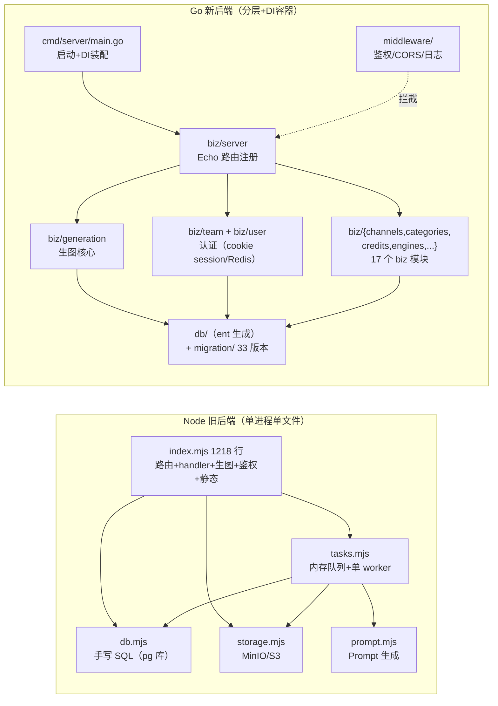

### Go 后端启动流程（`cmd/server/main.go`）

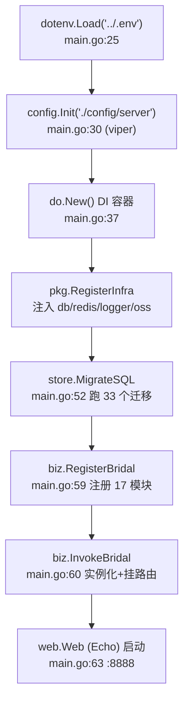

### Go biz 模块注册（`register.go`）

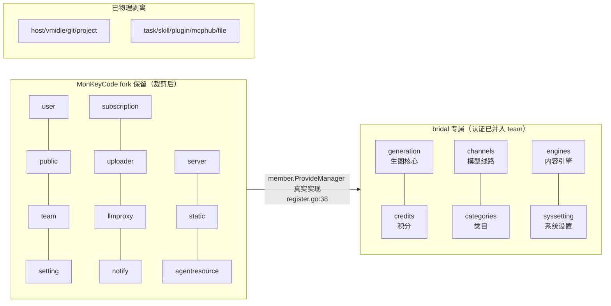

> **注**：`team` 模块（最大）依赖 `domain.MemberManager`。当前 `dev-dao` 已**弃用 noop 占位**，改用 `member.ProvideMemberManager` 真实实现（`register.go:38`），管理员可经 `/api/v1/teams/users` 增删成员。认证也统一走 team 模块的 cookie session（见第六节），**bridalauth 模块已整体删除**（9 文件）。

---

## 三、API 路由对比

| 路由 | Node | Go | 状态 |
|---|---|---|---|
| `POST /api/login` | ✅ `index.mjs:1140` | ✅ team `/api/v1/teams/users/login` | **Go 改路径+改机制** |
| `GET /api/me` | ✅ `index.mjs:1141` | ✅ team `/api/v1/teams/users/status` | **Go 改路径** |
| `POST /api/generate`（同步生图） | ✅ `index.mjs:1200` | ❌ | **Go 删除** |
| `POST /api/v1/generation`（异步） | ✅ `index.mjs:1184` | ✅ `handler.go:46` | 迁移 |
| `GET /api/v1/generation/tasks` | ✅ `index.mjs:1185` | ✅ `handler.go:48` | 迁移 |
| `GET /api/v1/generation/tasks/:id` | ✅ `index.mjs:1190` | ✅ `handler.go:49` | 迁移 |
| `POST /tasks/:id/cancel` | ✅ `index.mjs:1186` | ✅ `handler.go:50` | 迁移 |
| `GET /api/v1/generation/history` | ✅ `index.mjs:1197` | ✅ `handler.go:47` | 迁移 |
| `/api/admin/users` CRUD | ✅ `index.mjs:1144` | ✅ team `/api/v1/teams/users/*` | **Go 改路径** |
| `/api/admin/channels` CRUD | ✅ `index.mjs:1160` | ✅ channels | 迁移 |
| `/api/admin/categories` CRUD | ✅ `index.mjs:1173` | ✅ categories | 迁移 |
| `/api/credits/transactions` | ✅ `index.mjs:1156` | ✅ credits | 迁移 |
| `/api/v1/teams/*` | ❌ | ✅ team | **Go 新增（fork 带来）** |
| `/api/v1/generation/images/:filename` | `/api/generated/:key` | ✅ `handler.go:53` | 路径变更 |
| 历史查询参数 | `startDate/endDate` | `startTime/endTime` | **Go 修复不一致** |

> **关键修复**：前端 `src/api/generation.ts:62` 传 `startTime/endTime`，Node 后端 `index.mjs:906` 却读 `startDate/endDate`（参数对不上，筛选失效）；Go `handler.go:88` 读 `startTime/endTime`，与前端一致。

---

## 四、生图业务流程对比（核心）

### 4.1 Node：同步 + 异步双路径

```mermaid
flowchart TD
    subgraph 同步["同步路径 /api/generate（Node 独有，已删）"]
        S1["POST /api/generate<br/>index.mjs:925 handleGenerate"] --> S2["逐张串行调 WalaAPI<br/>阻塞 HTTP 连接"]
        S2 --> S3["全部完成后 insertHistory"]
        S3 --> S4["200 返回完整 record<br/>可能阻塞数分钟"]
    end
    subgraph 异步["异步路径 /api/v1/generation"]
        A1["POST /api/v1/generation<br/>index.mjs:765 handleCreateTask"] --> A2["积分校验 + 限流3 + 线路校验<br/>❌ 无每日额度校验"]
        A2 --> A3["insertTask(queued)<br/>index.mjs:832"]
        A3 --> A4["enqueueTask 入内存数组<br/>tasks.mjs:42"]
        A4 --> A5["202 立即返回 taskId"]
        A6["单 worker 串行消费<br/>tasks.mjs:62 runWorker"] --> A7["逐张调 WalaAPI + 存图 + 扣积分"]
        A7 --> A8["insertHistory + updateTask(completed)"]
        A9["前端 3s 轮询 GET /tasks/:id"]
    end
    A4 -.触发.-> A6
    A5 -.轮询.-> A9
```

### 4.2 Go：纯异步（goroutine）

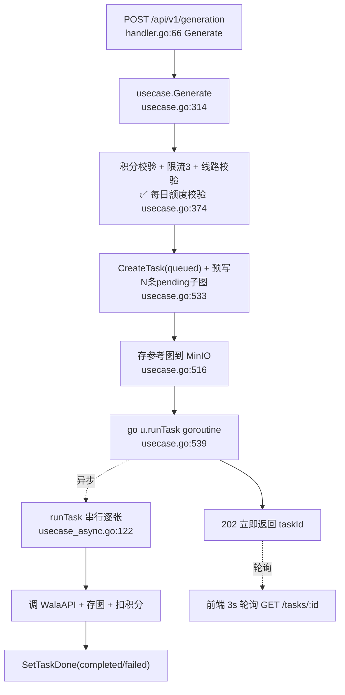

### 4.3 异步生图泳道图对比

**Node 异步生图泳道**（内存队列 + 单 worker）：

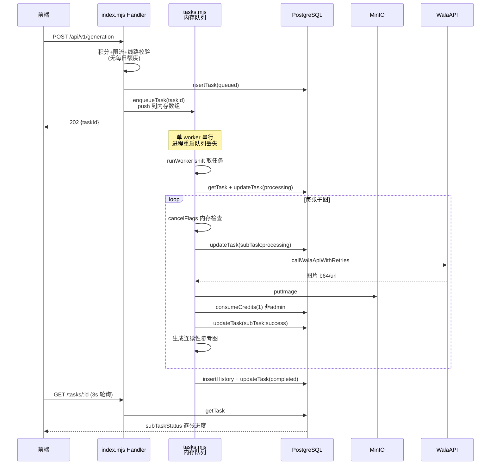

**Go 异步生图泳道**（goroutine + DB 状态轮询）：

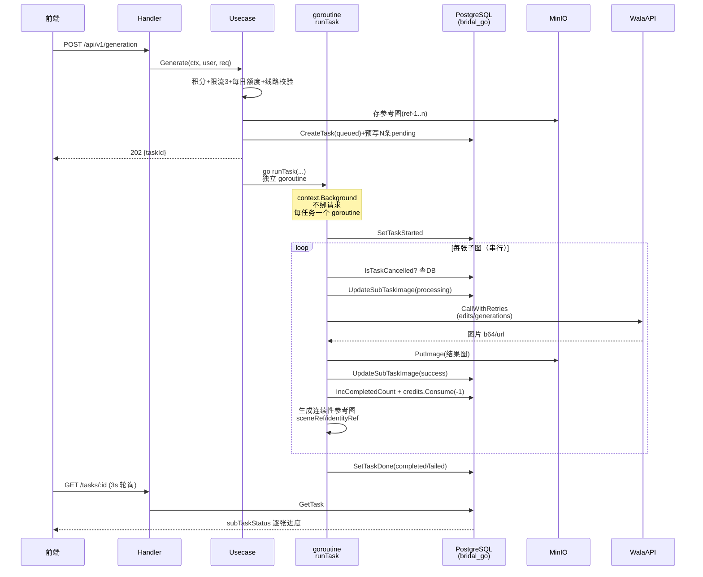

---

## 五、任务队列机制对比（核心差异）

| 机制 | Node `tasks.mjs` | Go `usecase_async.go` |
|---|---|---|
| 队列载体 | 内存数组 `queue = []`（`tasks.mjs:36`） | 无队列，直接 `go runTask`（`usecase.go:539`） |
| 消费者 | 单 worker（`workerRunning` 标志，`tasks.mjs:38`） | 每任务一个 goroutine |
| 串行性 | **全局串行**（单 worker 一次处理一个任务） | **任务内串行**（单任务逐张），**任务间并发** |
| 持久化 | ❌ 进程重启队列丢失（已 queued 未 processing 的任务卡住） | ✅ 状态在 DB，进程重启后 queued 任务状态保留（但 goroutine 不会自动恢复） |
| 取消检测 | 内存 `cancelFlags` Map（`tasks.mjs:37,287`） | DB 字段轮询 `IsTaskCancelled`（`usecase_async.go:168`） |
| 取消持久 | ❌ 进程重启取消标志丢失 | ✅ 取消写入 DB，持久 |
| 并发风险 | 无（串行） | 有（多用户同时提交多任务，goroutine 并发打 WalaAPI，仅靠"每用户3任务"限流） |

> **Go 的并发模型权衡**：Node 单 worker 串行，天然不会压垮上游 WalaAPI；Go 每任务一个 goroutine，若多用户同时提交，会并发请求 WalaAPI（上游失败率本就约 50%）。Go 靠"每用户最多 3 个进行中任务"（`usecase.go:370`）限流，但这是用户级，不是全局级。

> **Go 的恢复缺口**：进程崩溃时，已 `queued` 但未 `processing` 的任务，goroutine 不会自动恢复（`go runTask` 仅在 HTTP 请求时触发）。Node 同样有此问题（内存队列丢）。**两者都没有持久化任务恢复机制**。

---

## 六、认证流程（Node HMAC token -> Go cookie session，**已重构**）

> ⚠️ 当前 `dev-dao` 已**删除 bridalauth 模块**（9 文件），认证从「自研 HMAC Bearer token」整体改为「MonkeyCode team 模块的 cookie session（Redis）」。本节为最新实现，Node 旧机制仅作对照。

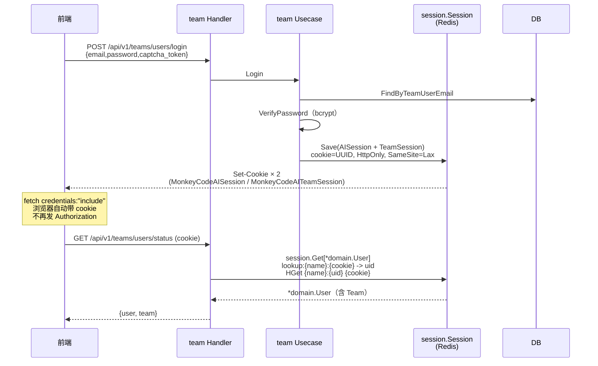

| 认证要素 | Node 旧后端 | Go 新后端（当前 `dev-dao`） | 一致性 |
|---|---|---|---|
| 机制 | HMAC-SHA256 Bearer token（`index.mjs:140`） | cookie session（Redis）（`middleware/auth.go:88`、`pkg/session/session.go`） | ❌ **已重构** |
| 凭证载体 | `Authorization: Bearer <token>` | Cookie `MonkeyCodeAISession`（HttpOnly, SameSite=Lax） | ❌ |
| 前端存储 | localStorage `bridal-content-studio-session` | 浏览器 cookie，`fetch(credentials:"include")`（`src/api/client.ts:63`） | ❌ |
| 服务端存储 | 无（token 自包含） | Redis Hash `{name}:{uid}` + lookup `lookup:{name}:{cookie}`（`session.go:59-63`） | ❌ |
| TTL | 24h（`index.mjs:90`） | `Session.ExpireDay` 天（`session.go:37`，可配） | ❌ |
| 登录入口 | `POST /api/login`（`index.mjs:1140`） | `POST /api/v1/teams/users/login`（`team/handler/http/v1/user.go:61`） | ❌ 改路径 |
| 当前用户 | `GET /api/me` | `GET /api/v1/teams/users/status` | ❌ 改路径 |
| 防时序 | `crypto.timingSafeEqual`（`index.mjs:157`） | Redis 查找，无签名比较 | - |
| 模块 | bridalauth（**已删除**） | team + user + middleware + pkg/session | ❌ |
| 初始账号 | 首次启动建 admin | `team.initTeam` 异步建（env `MCAI_INIT_TEAM_EMAIL/PASSWORD`，`register.go:33`） | ❌ |
| 双 session | 无 | `MonkeyCodeAISession`（业务）+ `MonkeyCodeAITeamSession`（团队） | Go 新增 |

> **关键变化**：认证不再是「1:1 一致」。Go 后端借 fork 自带 MonkeyCode team 模块的 cookie session 替代自研 HMAC token，session 落 Redis（双 session：`MonkeyCodeAISession` 走业务接口、`MonkeyCodeAITeamSession` 走团队接口）。**前端必须改动**：从 `Authorization: Bearer` + localStorage 改为 `credentials:"include"` + cookie（`src/api/client.ts:5,63`；契约见 `src/types/api.ts:5,112`「cookie 由后端 Set-Cookie 建立，无 token」）。bridalauth 模块（`token.go`/`password.go`/`usecase.go` 等 9 文件）已整体删除，`backend/biz/` 不再含该目录。

---

## 七、图组连续性（1:1 一致，核心资产）

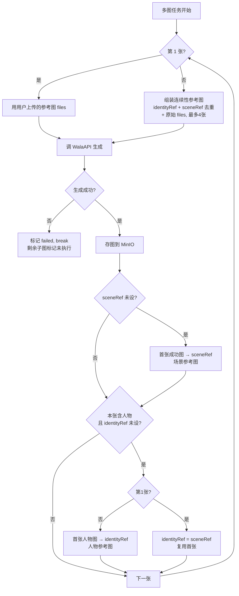

| 连续性要素 | Node | Go | 一致性 |
|---|---|---|---|
| 人物图类型 | `产品上身图/对镜穿搭图/生活场景图`（`index.mjs:944`） | 同（`usecase.go:63`） | ✅ |
| 场景参考图 | 首张成功图（`tasks.mjs:332`） | 同（`usecase_async.go:289`） | ✅ |
| 人物参考图 | 含人物时回传（`tasks.mjs:335`） | 同（`usecase_async.go:303`） | ✅ |
| 大小上限 | 20MB（`tasks.mjs:79`） | 20MB（`wala.MaxContinuityReferenceBytes`） | ✅ |
| 失败处理 | break，停止连续性 | break，停止连续性 | ✅ |
| 参考图去重 | sceneRef≠identityRef 时去重 | 同（`usecase_async.go:185`） | ✅ |

---

## 八、数据层对比

### 表结构对比

| 表 | Node `schema.sql`（7 张） | Go migration（33 版本，57 张） |
|---|---|---|
| users | ✅ 手写 SQL | ✅ ent schema + migration |
| history | ✅ | ✅（generation_tasks 复用） |
| generation_tasks | ✅ `schema.sql:104` | ✅ |
| generation_images | ❌ 子图状态存 tasks.sub_task_status JSONB | ✅ **独立表**，预写 N 条 pending 占位 |
| model_channels | ✅ `schema.sql:55` | ✅ |
| credit_transactions | ✅ `schema.sql:73` | ✅ |
| categories | ✅ `schema.sql:89` | ✅ |
| channel_stats | ✅ `schema.sql:133` | ✅ |
| teams/audits/... | ❌ | ✅ **MonKeyCode 带来，bridal 部分未用** |

### 迁移机制对比

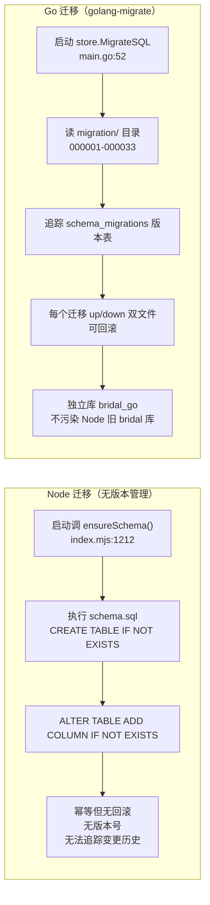

> **关键坑**：Go migration 是 MonKeyCode 风格，与 Node schema 不兼容，**必须用独立库 `bridal_go`**，不能复用 Node 旧 `bridal` 库（表名冲突）。ent schema 加字段后必须手写对应 migration（golang-migrate 不自动加列），否则查询报 `column does not exist`。

### ORM 对比

| 维度 | Node（手写 SQL） | Go（ent） |
|---|---|---|
| 查询 | `query('SELECT...', [params])`（`db.mjs`） | `client.GenerationTask.Query().Where(...)` |
| 事务 | `withTransaction`（`db.mjs`） | `client.Tx()` + ent 事务 |
| 类型安全 | ❌ 运行时 | ✅ 编译期（`db/generationtask/where.go` 生成） |
| 代码生成 | ❌ | ✅ `go generate ./ent` 生成 CRUD |

---

## 九、WalaAPI 调用对比（1:1 一致）

| 要素 | Node `index.mjs`/`tasks.mjs` | Go `wala/client.go` | 一致性 |
|---|---|---|---|
| 有参考图 | `POST /images/edits`（multipart） | 同 | ✅ |
| 无参考图 | `POST /images/generations`（JSON） | 同 | ✅ |
| 默认尺寸 | `1152x1536` | 同 | ✅ |
| 重试次数 | 3（`WALA_IMAGE_RETRY_ATTEMPTS`） | 3 | ✅ |
| 重试触发 | 429/502/503/504 + "上游负载已饱和"中文串（`index.mjs:297`） | 同 | ✅ |
| 退避 | `min(30s, 4s*2^(n-1))`（`index.mjs:293`） | 同 | ✅ |
| 超时 | `WALA_IMAGE_TIMEOUT_MS` 默认 180000ms | 同 | ✅ |
| 模型 | 硬编码 `gpt-image-2`（`index.mjs:81`） | 读 env（`usecase.go:466`） | ⚠️ Go 更灵活 |
| 线路配置 | channel 覆盖 apiKey/baseUrl/model（`tasks.mjs:178`） | 同（`usecase_async.go:137`） | ✅ |

---

## 十、核心差异总结

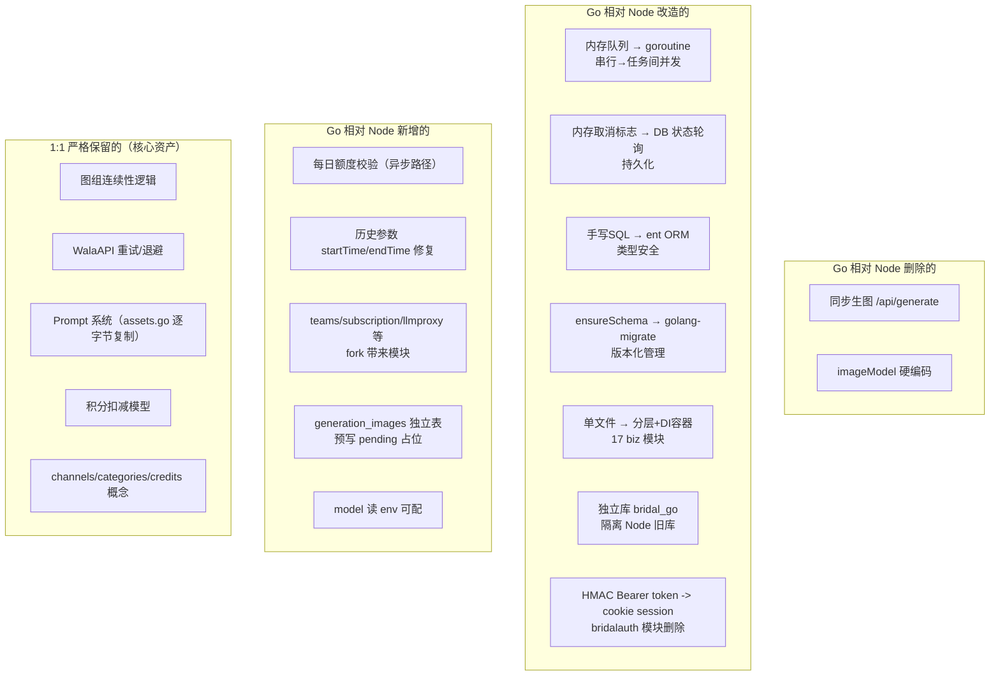

### 风险与缺口

| 项 | 说明 |
|---|---|
| ⚠️ 任务恢复缺口 | Go 进程崩溃时 `queued` 未 `processing` 任务不会自动恢复（goroutine 仅 HTTP 触发）。Node 同样有此问题。**两者都无持久化恢复** |
| ⚠️ 并发压上游 | Go goroutine 模型下多用户并发打 WalaAPI（上游失败率 50%），靠全局信号量（`WalaConcurrencyLimit` 默认 5）+ 用户级限流（每用户3任务）护栏 |
| ⚠️ 安全偏弱 | Go 已改 cookie session（Redis 存），仍无速率限制；Node 时代为 HMAC token 非 JWT |
| ✅ 数据隔离 | Go 独立库 bridal_go，不污染 Node 旧库 |
| ❌ 前端需改 | 认证改 cookie session，前端从 Bearer+localStorage 改 credentials+cookie（见第六节）；生图 API 契约保持一致 |

---

## 十一、升级后的优缺点（生图业务视角）

> **立场**：已迁移到 Go 后端，目标是「**生图业务能跑起来**」。其中**提示词系统（`prompt/prompt.go` + `assets.go`）与内容引擎（`src/utils/generateFashionSeedingContent.ts`）是核心资产，1:1 和谐保留、不动**；其余（认证、队列、数据层、模块结构、配置）均可改。本节据此评价 Go 升级的得失。

### 11.1 优点（✅ 对生图业务是净收益）

| 项 | 说明 | 依据 |
|---|---|---|
| 异步任务 + 逐张进度 | 提交即返回 taskId，前端 3s 轮询拿子图状态，不再像 Node 同步路径阻塞数分钟 | `usecase.go:543`、`repo_async.go:79` |
| 子图独立状态 | `generation_images` 表预写 N 条 pending，每张独立 status/latency，进度可见 | `ent/schema/generationimage.go:39` |
| 取消持久化 | 取消写 DB 字段，worker 轮询检测；Node 是内存 Map，进程重启即丢 | `usecase_async.go:168`、`repo_async.go:231` |
| 崩溃恢复 | 启动把未完成任务标 failed，状态清晰（虽不自动恢复 goroutine） | `register.go:24`、`repo_async.go:261` |
| 全局并发保护 | 信号量 `WalaConcurrencyLimit`（默认 5）限流打上游，Node 无全局并发控制 | `usecase_async.go:206` |
| 模型线路可配 | `channels` 表，admin 可配多线路 + 稳定性统计；Node 时代单一 .env | `ent/schema/modelchannel.go`、`usecase_async.go:137` |
| 积分系统 | credits 每张成功扣 1，admin 不限量；Node 仅每日额度 | `usecase_async.go:284`、`domain/user.go:149` |
| 类型安全 + 版本化迁移 | ent 编译期类型 + golang-migrate 33 版本可回滚；Node 手写 SQL 无版本 | `db/`、`migration/` |
| 独立库隔离 | `bridal_go` 不污染 Node 旧 `bridal` 库 | `main.go:52` |
| 模型可配 | env `WalaImageModel`，Node 硬编码 `gpt-image-2` | `config.go` |
| **核心资产 1:1 保留** | Prompt 拼装、图组连续性、WalaAPI 重试/退避逐字节迁移，生图质量不退化 | `prompt/assets.go:2`、`usecase_async.go:181` |

### 11.2 原列缺点的核实结论

经逐条核实，原列「缺点/风险」多数不成立或已消解：

| 原列项 | 实际性质 | 核实结论 |
|---|---|---|
| Redis 强依赖 | ✅ 增强能力 | Redis 是 session + 未来缓存/队列基础，支持多实例水平扩展；session 落 Redis 是能力提升而非负担 |
| 前端必须改 | ✅ 已完成 | 前端已迁至 `credentials:"include"` + cookie（`src/api/client.ts:63`），不再是待办 |
| 并发压上游 | ➡️ 中性/好事 | 压力在上游 WalaAPI 说明业务有量，Go 后端有全局信号量（默认 5）+ 用户级限流护栏，自身不扛压 |
| 崩溃恢复不彻底 | ➡️ 合理设计 | 崩溃后未完成任务标 failed，状态清晰，用户手动重提；不自动恢复 goroutine 是简单可靠的取舍 |
| 配置面变大 | ❌ 不成立 | 配置主路径是 env（`MCAI_BRIDAL_*`/`WALA_*`），channels 表仅运行时线路管理，默认值从 env seed |
| ent 不用 edge | ➡️ 工程妥协 | ent edge 是 ORM 关联，不用它是为避免自动外键列名（`generation_task_images`）与手写 migration（`task_id`）冲突，手写两步查询，影响轻微（`generationtask.go:64`） |
| stats.go 遗留 bug | ✅ 已修复 | `UserStats` 误判任务级 `status=="success"`（应为 `completed`），已修复（`stats.go:39`）。注：该适配器当前无外部调用方，系预留 |
| 安全仍偏弱 | ❌ 不成立 | cookie session（HttpOnly + SameSite=Lax）+ Redis 查找 + ent 参数化查询，对当前单租户生图业务已足够强 |
| 部署变重 | ❌ 不成立 | Docker 一次性部署，后续升级只需更新 migration + Go 后端二进制 + 前端 dist，基础设施容器（PG/Redis/MinIO）不动 |

> **结论**：Go 升级对「生图业务能跑」**无重大缺点**。原列项要么是增强能力（Redis）、要么已完成（前端）、要么是合理设计（崩溃恢复）、要么不成立（配置/安全/部署），stats.go bug 已修复。

### 11.3 中性取舍

- **同步生图删除**（Go 仅异步）：对生图业务是净收益（避免长连接阻塞），但若有外部依赖同步 `/api/generate` 需迁移。
- **estimatedSeconds = N*90**：粗略估时，上游失败率高时偏差大，仅作前端提示用。
- **MonkeyCode 模块底座**：fork 带来的 team/subscription/llmproxy/notify/agentresource 等模块当前不直接服务生图业务，但作为**未来业务升级（多租户团队协作、LLM 代理、通知、资源管理）的预留底座**保留，是前期投入而非冗余负担。
- **前端部署需 nginx**：Go 后端 static 模块只 serve `/static` 前缀资源（`config.go:427`，dir=`/app/static`），**不 serve 前端 SPA**。前端 dist 需独立静态服务 + SPA fallback（`try_files $uri /index.html`）+ `/api` 反代 Go :8888，nginx 是标准方案。Makefile 的 `ingress` 目标即为此设计，但 `build/Dockerfile.ingress` 尚未提交，需补。

### 11.4 结论

从「生图业务能跑起来」看，Go 升级**全面正向**：异步化、进度可见、取消持久、并发保护、线路可配、崩溃恢复，每一项都直接提升生图业务的健壮性，且核心资产（Prompt + 图组连续性 + 内容引擎）1:1 保留，生图质量不退化；Redis 增强、前端迁移、stats.go 修复均已完成，原列缺点经核实无重大遗留。

两个后续提示：
1. **并发护栏需观察**：WalaAPI 失败率约 50%，全局信号量（默认 5）是当前唯一护栏，上线后按实际负载调。
2. **前端部署需补 nginx**：补 `build/Dockerfile.ingress`（nginx serve dist + `try_files` SPA fallback + `/api` 反代 :8888），或让 Go 后端加 SPA handler 统一 serve。

---

## 附：文件规模对照

| Node 文件 | 行数 | Go 对应 | 文件数 |
|---|---|---|---|
| `index.mjs`（路由+handler+生图+鉴权） | 1218 | `biz/generation/` + `biz/team/`+`biz/user/` + `biz/server/` | 12+大量+3 |
| `db.mjs`（数据访问） | - | `db/`（ent 生成）+ `biz/*/repo.go` | 大量生成代码 |
| `tasks.mjs`（队列+worker） | 439 | `biz/generation/usecase_async.go` | 1 |
| `storage.mjs`（MinIO） | 63 | `biz/generation/imagestore/` | - |
| `prompt.mjs`（Prompt） | - | `biz/generation/prompt/{assets,prompt}.go` | 2 |
| `schema.sql`（7 表） | 142 | `migration/`（33 版本，57 表）+ `ent/schema/` | 33×2 |
| **总计** | **~6 文件** | **17 biz 模块 + db + ent + migration** | **200+ 文件** |
